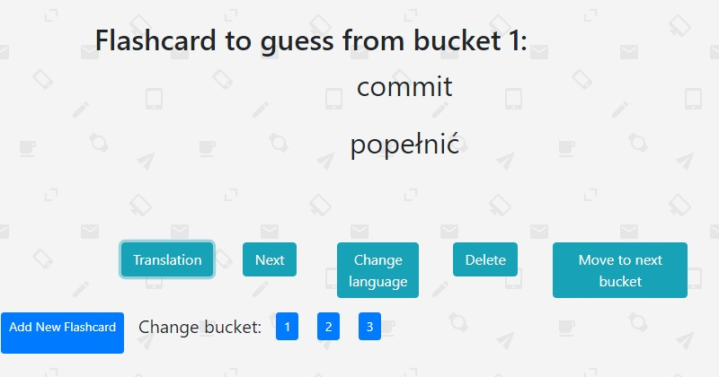

# Flashcards
> Application made for myself to fast add words to database and easy learn them. With flashcards it's easy to learn by repeating words every day

## Table of contents
* [General info](#general-info)
* [Technologies](#technologies)
* [Screenshots](#screenshots)
* [Status](#status)

## General info
It's uploaded on [rafalwizen-flashcards.herokuapp.com/game](https://rafalwizen-flashcards.herokuapp.com/game)

## Technologies
* Java - version 1.8
* Spring - version 5.1.9.RELEASE
* Hibernate - version 5.4.8.RELEASE
* Thymeleaf - version 3.0.11.RELEASE
* HTML - version 5
* CSS - version 3
* Bootstrap - version 4.3.1
* Maven - version 4.0.0

## Screenshots

## Status

It's already in beta version.

